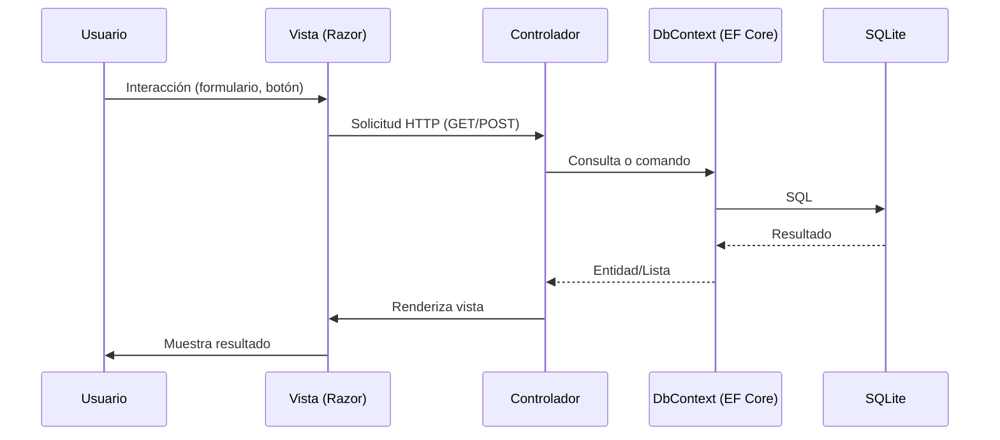

# Conceptual Overview

## 1. Casos de uso

| Rol           | Acciones principales                                                                                   |
|---------------|-------------------------------------------------------------------------------------------------------|
| **Profesor**  | Crear cursos, agregar secciones, subir materiales didácticos, gestionar inscripciones de alumnos      |
| **Administrador** | Gestionar usuarios, alumnos, cursos; acceso completo a todas las operaciones CRUD                  |
| **Alumno**    | Inscribirse en secciones, visualizar materiales, consultar información de sus cursos                  |
 
---

## 2. Modelos de dominio

- **Usuario**: Representa a cualquier usuario autenticado (alumno, profesor, admin).  
    _Propiedades_: correo, contraseña, rol, nombre, apellido, etc.
- **Alumno**: Entidad específica para estudiantes, con datos personales y de contacto.
- **Curso**: Define una materia o asignatura, identificada por nombre y código de institución.
- **Sección**: Subdivisión de un curso, asociada a un profesor y a múltiples inscripciones y materiales.
- **Inscripción**: Relaciona a un alumno con una sección (_muchos a muchos_).
- **Material**: Archivo subido por un profesor, vinculado a una sección y almacenado en el servidor.

**Relaciones:**
- Un `Curso` tiene muchas `Secciones`.
- Una `Sección` pertenece a un `Curso` y tiene un `Profesor` (Usuario).
- Un `Alumno` puede estar inscrito en varias `Secciones` (a través de `Inscripción`).
- Una `Sección` tiene muchos `Materiales`.

---

## 3. Controladores y rutas

- **HomeController** (`/Home`):  
    Login, logout, gestión de alumnos  
    - `/Home/Index`  
    - `/Home/Crear`  
    - `/Home/Editar`  
    - `/Home/Eliminar`
- **SeccionController** (`/Seccion`):  
    Listar secciones, ver detalles
- **MaterialController** (`/Material`):  
    Subir y listar materiales por sección  
    - `/Material/Create/{seccionId}`  
    - `/Material/Index/{seccionId}`

**Ejemplo de rutas:**
```
GET    /Home/Index                // Lista de alumnos
POST   /Home/Crear                // Crear alumno
POST   /Home/Editar/{id}          // Editar alumno
POST   /Home/Eliminar             // Eliminar alumno
GET    /Seccion/Index             // Ver secciones
GET    /Material/Index/{seccionId} // Ver materiales de una sección
POST   /Material/Create           // Subir material
```

---

## 4. Flujo de datos

**Descripción:**  
El usuario interactúa con una vista Razor, que envía datos al controlador. El controlador usa `AppDbContext` (EF Core) para leer/escribir en SQLite. El resultado se muestra en la vista.

**Diagrama (Mermaid):**


---

## 5. Mapeo ORM

Entity Framework Core convierte las clases C# en tablas SQLite.  
- Las propiedades `[Key]` son claves primarias.
- Las relaciones se infieren por nombres (`SeccionId`, `CursoId`, etc.) y propiedades de navegación.
- Las migraciones (`Migrations/`) mantienen el esquema sincronizado.

**Ejemplo:**
```csharp
public class Material {
        [Key]
        public int Id { get; set; }
        public int SeccionId { get; set; }
        public Seccion Seccion { get; set; }
}
```
Esto crea una tabla `Materiales` con una clave foránea a `Secciones`.

---

## 6. Carga de archivos

- El tamaño máximo de archivo se configura en `Program.cs`:
    ```csharp
    options.MultipartBodyLengthLimit = 50 * 1024 * 1024; // 50 MB
    ```
- Los archivos se guardan en `wwwroot/materiales/{seccionId}/`.
- El modelo `Material` almacena la ruta relativa (`FilePath`) y metadatos.
- Solo profesores/admin pueden subir archivos; se valida tipo y tamaño.

---

## 7. Ejemplo de extremo a extremo

1. El profesor inicia sesión.
2. Crea un curso y una sección desde la interfaz correspondiente.
3. Accede a la sección y selecciona "Subir Material".
4. Completa el formulario y adjunta un archivo (PDF, DOCX, etc.).
5. El archivo se guarda en el servidor y se crea un registro en la base de datos.
6. Alumnos inscritos pueden ver y descargar el material desde `/Material/Index/{seccionId}`.

**Ejemplo visual:**
```
Profesor → [Crea Curso] → [Agrega Sección] → [Sube Material]
Alumno   → [Se inscribe] → [Visualiza Materiales]
```